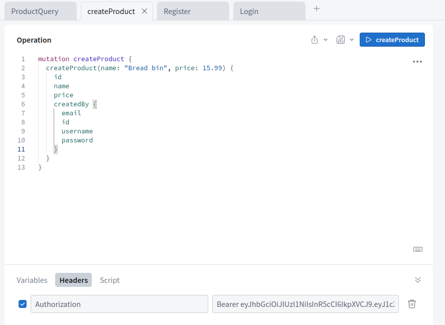

## Typescript project with:

* Postgres
* Graphql
* Authentication
* Authorization

```
yarn watch
yarn dev
```

http://localhost:5000/

### Register
```graphql
mutation Register {
    register(username: "bob1", email: "bob@zmail.com", password: "123456") {
        token
        user {
            id
            email
            username
            password
        }
    }
}
```
Once registered you can login.

### Login
```graphql
mutation Login {
  login(username: "bob1", password: "123456") {
    token,
    user {
      id
      email
      password
      username
    }
  }
}
```

Grab token from register or login response and add as Authorization header in studio as per screen shot.



### Create product
```graphql
mutation createProduct {
  createProduct(name: "Bread bin", price: 15.99) {
    id
    name
    price
    createdBy {
      email
      id
      username
      password
    }
  }
}
```

### Get all products
```graphql
query ProductQuery {
  products {
    id
    name
    price
  }
}
```